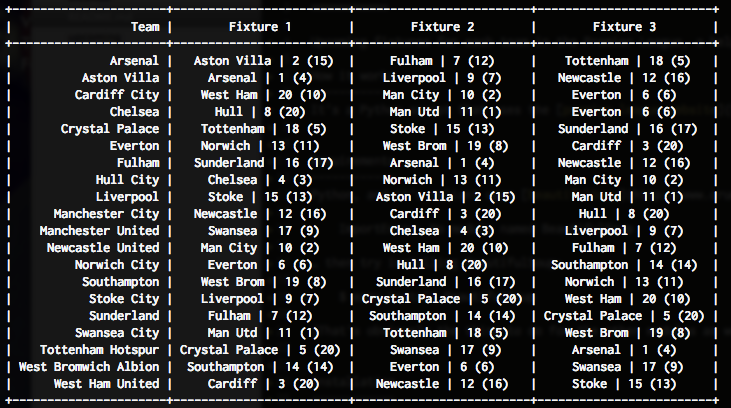

Upcoming
===========

Upcoming fixtures for each team in the Premier League, a helper for Fantasy Football.

How it works
------------
It's a Python script that uses the [premier league website](http://www.premierleague.com/en-gb.html) to show the upcoming fixtures for all teams in the Premier League

Requirements
------------
Python, and it's reliant upon (amongst other modules) [BeautifulSoup](http://www.crummy.com/software/BeautifulSoup/) (version 4) to parse the HTML. If you see the following error:

	ImportError: No module named BeautifulSoup

… then try installing BeautifulSoup:

	$ easy_install BeautifulSoup

(That's obviously the thing to do for the other modules as well, should they be missing)

	
Installation
------------
	$ mkdir -p ~/bin
	$ curl -skL https://raw.github.com/howlingmad/ff-upcoming/master/upcoming >~/bin/upcoming
	$ chmod +x ~/bin/upcoming
	
Make sure `~/bin` is in your `$PATH` - or put the `upcoming` script somewhere else on your `$PATH`.
	
	
Usage
-----
	$ upcoming
	
This will show the next **3** results for each current team in the EPL

	$ upcoming 4
	
This will show the next **4** results for each current team in the EPL. You can show a maximum of 6 results

	$ upcoming 5 -j
	
Adding the -j option outputs the results as json in data.json

Example
-------

The number after each fixture shows the current league position, to guage difficulty. the number in brackets is last seasons finishing position (useful if the season has not started).
	
	
Author
------
Alex Kilgour : [http://kil.gr](http://kil.gr)
